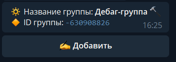
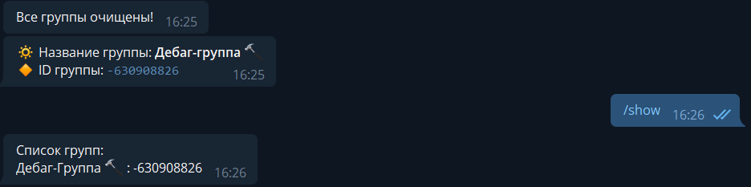
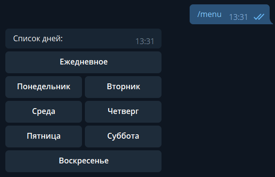
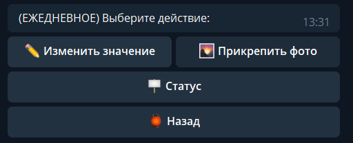
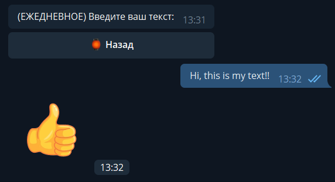

# Telegram message sender to groups

## Used libraries:
> aiogram
> 
> aioschedule

## Installing modules:
```
sudo apt update -y && sudo apt upgrade -y
pip3 install pytelegrambotapi aiogram aioschedule
```

## Commands:
> /start

> /set [id]
> /reset - clear groups id
> /show - show all set groups
> /show - sent message only with text attached to days

> /help


> /show




> /menu
>> menu of days 



>> action menu



> RESULT OF SENDING


> Thanks for using! :)
